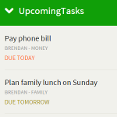
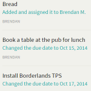
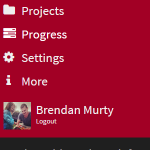

UpcomingTasks
=======

## About

[UpcomingTasks](http://murty.io/brendan/post/20161014_farewell-upcomingtasks) was a free web-based [Basecamp 2](https://basecamp.com/2) client that I developed to easily manage tasks on smaller devices.

Users had the option to upgrade to a Pro account which unlocks [additional features](http://murty.io/brendan/post/20151007_announcing-upcomingtasks-pro).

It was created in [Sublime Text](http://www.sublimetext.com/) using the [Basecamp API](https://github.com/basecamp/bcx-api) and hosted by [Digital Ocean](http://digitalocean.com).

The service was online from September 2012 and then [retired on 15 November, 2016](http://murty.io/brendan/post/20161014_farewell-upcomingtasks).

  

## Why Open Source?

I was inspired by [Brad Frost](https://github.com/bradfrost)'s [TED talk](https://twitter.com/brad_frost/status/476515058738925568) about being open by default. If you haven't seen this talk yet, I'd recommend investing half an hour to [watch the video](https://www.youtube.com/watch?v=7rW9vTrN6OU) and read the [blog post](http://bradfrostweb.com/blog/post/creative-exhaust/).

As I'm self-taught, engaging with the [community](https://twitter.com/brendanmurty/lists/web-design/members), [listening to inspirational people](http://boagworld.com/show) and [reading about new techniques](https://signalvnoise.com/programming) helped me turn my passion in to my career.

I hope an aspiring web developer can learn something new from what I've done here and start their own career. Hopefully I can give back to the community that has taught me so much over the last few years.

## Installation

Here's the steps that I go through to configure a new UpcomingTasks server on a [Digital Ocean](https://www.digitalocean.com) Ubuntu 14.04 VPS.

### Install required packages

    sudo apt-get update
    sudo apt-get -y install git apache2 mysql-server libapache2-mod-auth-mysql php5 php5-mysql libapache2-mod-php5 php5-mcrypt php5-cgi php5-curl sendmail

### Initialise a Git clone of the code

First you'll need to [configure a SSH key](https://confluence.atlassian.com/bitbucket/set-up-an-ssh-key-728138079.html).

Then you can make a copy of the repository in a suitable directory, such as `/var/www/html`:

    git clone git@bitbucket.org:brendanmurty/upcomingtasks.git .

### Configure application authentication information

    cp libs/auth.php.sample libs/auth.php
    vim libs/auth.php

Update the authentication tokens and login information in this private file.

### Setup the database and create the "users" table

    mysql -u root -p
    [enter root user password]
    create database upcomingtasks;
    exit
    mysql -u root -p upcomingtasks < scripts/sql/users.sql
    [enter root user password]

### Configure the server to use the customised ".htaccess" file

    sudo cp scripts/server/web-server.conf /etc/apache2/sites-available/000-default.conf
    vim /etc/apache2/sites-available/000-default.conf

Update the *ServerName* and *ServerAdmin* values to suit your server and email address.

    vim .htaccess

Update the domain references in this file.

    sudo service apache2 restart

### Setup the SSL certificate (optional)

If you've setup your Basecamp Integration app to use a HTTPS URL then you'll first need to purchase and [configure an SSL certificate](https://www.digitalocean.com/community/tutorials/how-to-install-an-ssl-certificate-from-a-commercial-certificate-authority) on your server.

    sudo cp scripts/server/ssl.conf /etc/apache2/sites-available/default-ssl.conf
    vim /etc/apache2/sites-available/default-ssl.conf

Update the domain, admin and SSL path values to suit your information and the locations of your certificate files.

    sudo service apache2 restart

## License

You can view the [License](https://bitbucket.org/brendanmurty/upcomingtasks/src/master/license.md) file for rights and limitations when using the code here in your own projects.

The license is based on the [CSS-Tricks License](https://css-tricks.com/license/) which was created by [Chris Coyier](https://github.com/chriscoyier/).
